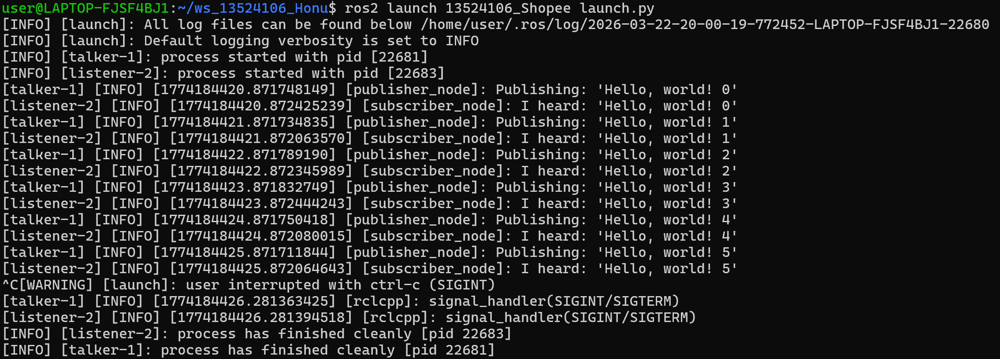

## Repository Structure
### Workspace Filetree (Level 2 Depth)
.
├── build
│   ├── 13524106_Shopee
│   └── COLCON_IGNORE
├── install
│   ├── 13524106_Shopee
│   ├── COLCON_IGNORE
│   ├── local_setup.bash
│   ├── local_setup.ps1
│   ├── local_setup.sh
│   ├── _local_setup_util_ps1.py
│   ├── _local_setup_util_sh.py
│   ├── local_setup.zsh
│   ├── setup.bash
│   ├── setup.ps1
│   ├── setup.sh
│   └── setup.zsh
├── log
│   ├── build_2026-03-22_19-38-49
│   ├── build_2026-03-22_19-38-58
│   ├── build_2026-03-22_19-39-20
│   ├── build_2026-03-22_19-39-55
│   ├── build_2026-03-22_19-41-43
│   ├── build_2026-03-22_19-42-49
│   ├── build_2026-03-22_19-57-12
│   ├── build_2026-03-22_19-58-07
│   ├── build_2026-03-22_19-58-32
│   ├── build_2026-03-22_20-00-14
│   ├── COLCON_IGNORE
│   ├── latest -> latest_build
│   └── latest_build -> build_2026-03-22_20-00-14
├── README.md
└── src
    └── 13524106_Shopee

19 directories, 14 files

### Package Filetree
.
├── CMakeLists.txt
├── include
│   └── 13524106_Shopee
├── launch.py
├── LICENSE
├── package.xml
└── src
    ├── publisher.cpp
    └── subscriber.cpp

3 directories, 6 files

## Result Screenshot

